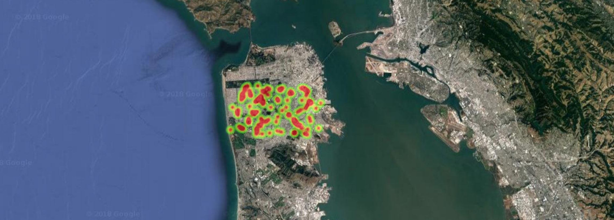

# Heat map of property listings in San Francisco


## Design
### Back End:

 1. **Bridge API** To retrieve coordinates of property listing stored in "test" dataset.

 2. **Express.js / Node.js** To render front-end html page and expose API for client to retrieve data dynamically.

### Front End:
 1. **Google Map HeatMap API** To create a heat map view.
 
 2. **JQuery Ajax** To request JSON type data from server.

## Quick Start

    $ yarn install 
    $ yarn run start
The application should be available on: http://localhost:3000.
    
## Limitations
1. All I need for the application is listing's coordinates. To my opinion, **/{dataset}/listings/maps** API should be used, since it retrieves map coordinates and allows for high limit queries as high as 10,000. However, the API doesn't work as expected. The actual queried results are missing coordinates data, which is not consistent with what documentation suggests. 

Sample API response
```json
{"success":true,"status":200,
 "bundle":
 [{"ListingKey":"P_5a3d5e426697a855ae982e75",
   "url":"https://rets.io/api/v2/test/listings/P_5a3d5e426697a855ae982e75"}],
 "total":1783}
```

2. **GET /{dataset}/listings** was therefore used, since this API restricts query to a max of 100 records, only part of data is shown in the application.

## Assumption
Based on visual analysis, It was assumed that all properties in the current dataset are located in San Francisco.
